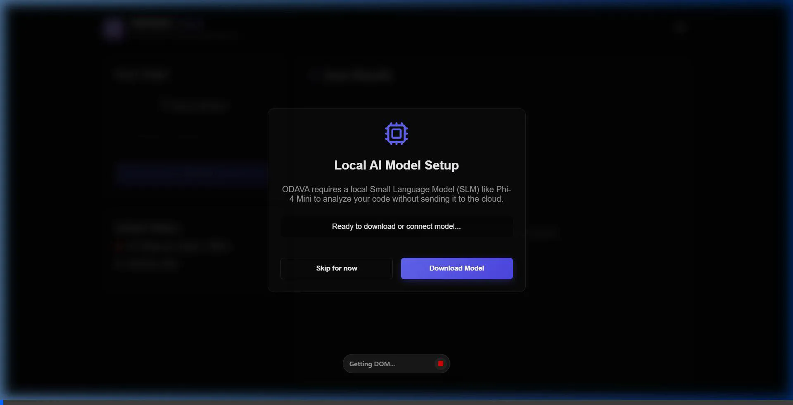
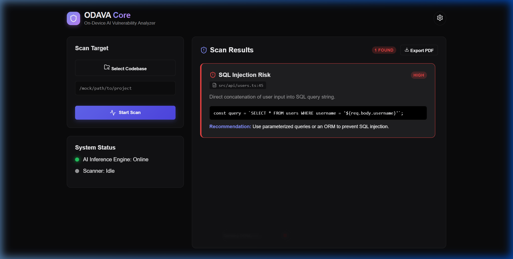

# ODAVA Core - On-Device AI Vulnerability Analyzer


ODAVA (On-Device AI Vulnerability Analyzer) is a cutting-edge desktop application built with Electron, React, and TypeScript. It is designed to perform incredibly fast, highly accurate, and completely offline **Static Application Security Testing (SAST)** on local codebases.

With ODAVA, sensitive source code never leaves the developer's machine. It leverages local Small Language Models (SLMs) running via `node-llama-cpp` to deliver contextual vulnerability analysis.

---

## 🎬 See it in Action





---

## ✨ Key Features

- 🔒 **Absolute Privacy:** 100% local analysis. Zero data exfiltration. No API keys or internet connection required for inference.
- ⚡ **Hybrid Scanning Engine:** Combines high-speed static heuristic rules with deep AI enrichment to prevent LLM context explosion.
- 🎯 **AI-Enriched Findings:** Uses local AI to reduce false positives and provide specific, actionable remediation steps strictly formatted in JSON.
- 📊 **PDF Reporting:** Instantly generate and export professional vulnerability reports as PDF documents.
- 🖥️ **Premium Dashboard:** A stunning, glassmorphism-inspired React interface for real-time progress and vulnerability management, styled with Vanilla CSS and bundled lightning-fast with Vite.

## 🏗️ System Architecture & Working Process

To maximize performance and prevent the AI context window from being overwhelmed, ODAVA uses a sophisticated two-phase hybrid scanning approach.

### Phase 1: High-Speed Static Rule Engine (Pre-Scan)
The scanner traverses the selected directory (skipping ignored folders like `node_modules` and `.git`). It passes file contents to the `SecurityRuleEngine`, which utilizes highly sensitive pre-defined heuristic patterns (Regex/AST-based) mapped to OWASP Top 10 and common CWE vulnerabilities.

#### 🛡️ False Negative Mitigation
Phase 1 is explicitly designed to **over-flag**. By maintaining a continuously updated, broad-reaching heuristic rule-set, the system ensures that potentially vulnerable code constructs are never missed (minimizing false negatives). The heavy lifting of filtering out the noise is deferred to the AI in Phase 2.

### Phase 2: Deep AI Enrichment
Once the static engine flags a vulnerable code snippet, ODAVA isolates the snippet and passes it to the local AI model.
- The AI Service intelligently resets its session context before each prompt to ensure lightning-fast inference.
- The LLM acts as a senior security reviewer, verifying the snippet and outputting a structured JSON response containing a context-aware description and concrete remediation guidance.
- If the AI determines the snippet is actually safe (e.g., proper escaping was used outside the static rule's visibility), it flags it as a likely false positive. These are retained in a separate "Reviewed" section for transparency, ensuring a human can still catch a bad call without cluttering the primary findings.

## 🔍 Detected Categories

ODAVA specifically targets the following vulnerability categories mapped to the OWASP Top 10:

| CWE ID | Category |
| :--- | :--- |
| **CWE-89** | SQL Injection |
| **CWE-78/95** | Command / Code Injection |
| **CWE-798** | Hardcoded Credentials / Secrets |
| **CWE-79** | Cross-Site Scripting (XSS) |
| **CWE-22** | Path Traversal |
| **CWE-327** | Broken/Weak Cryptography |
| **CWE-1321** | Prototype Pollution |
| **CWE-918** | Server-Side Request Forgery (SSRF) |

## 🏎️ Performance Metrics & Benchmarks

ODAVA is built for speed. **Benchmark Methodology:** The following metrics were captured using a test corpus of 10,000 LOC on an Apple M2 with 16GB RAM, running our highly-efficient "Lightweight Mode" model (`Qwen2.5-0.5B-Instruct-Q4_K_M.gguf`). 

- **Static Engine Speed:** `< 50ms` to scan 10,000 lines of code.
- **AI Inference Time:** `~1.2s - 2.0s` average per finding.
- **Memory Consumption:** `~1.5GB RAM` maximum footprint during active scanning.

*Note: Running larger models (like Phi-4 Mini or Gemma 3/4) will significantly alter these benchmarks, requiring 3-4GB of RAM and increasing inference time per finding.*

## 🧠 The AI Models

ODAVA uses `node-llama-cpp` to interact with Small Language Models locally. We recommend quantization at **Q4_K_M** (GGUF format) for the optimal balance of speed and memory.

### Recommended Models:
1. **Phi-4 Mini (3.8B):** Excellent instruction-following for strict JSON grammar constraints. (License: MIT)
2. **Gemma 3 Nano (E2B/E4B) / Gemma 4:** Heavily optimized for on-device reasoning. Note that these require a minimum of 3-4GB RAM footprint. (License: Google Terms of Use)
3. **Qwen2.5-0.5B-Instruct:** Our "Lightweight Mode" fallback. Only ~400-500MB on disk, capable of running in under 1.5GB of RAM.

## ⚠️ Limitations

As a local Static Application Security Testing (SAST) tool, ODAVA has intrinsic limitations:
- **Scope:** Phase 2's AI review is scoped to an isolated snippet. It cannot see cross-file taint flow, meaning multi-hop vulnerabilities might slip through.
- **Coverage:** ODAVA performs SAST only. It does not check for vulnerable dependencies (SCA), dynamically test the application (DAST), or hunt for secrets in git history.
- **Not a Silver Bullet:** ODAVA is an early-warning developer tool, not a substitute for professional security audits or CI/CD gatekeepers before production releases.

## 🚀 Getting Started

### Prerequisites
- [Node.js](https://nodejs.org/en/) (v18+)

### Installation

Clone the repository and install dependencies:

```bash
git clone https://github.com/dead-sirius/ODAVA.git
cd ODAVA
npm install
```

### Development

Run the application in development mode (powered by Vite):

```bash
npm run dev
```

### Build

Compile the application for your respective operating system:

```bash
# For Windows
npm run build:win

# For macOS
npm run build:mac

# For Linux
npm run build:linux
```

## 📄 License

This project is licensed under the MIT License.
